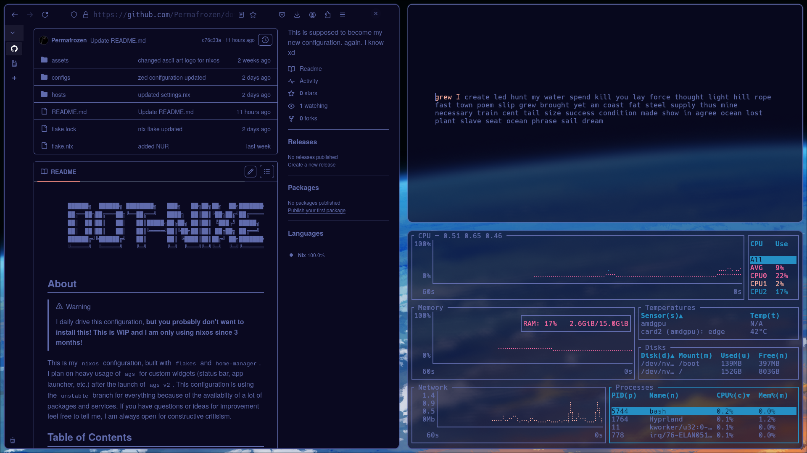

<div align="center">
  <pre>
    ██████╗  ██████╗ ████████╗   ███╗   ██╗██╗██╗  ██╗███████╗
    ██╔══██╗██╔═══██╗╚══██╔══╝   ████╗  ██║██║╚██╗██╔╝██╔════╝
    ██║  ██║██║   ██║   ██║█████╗██╔██╗ ██║██║ ╚███╔╝ █████╗  
    ██║  ██║██║   ██║   ██║╚════╝██║╚██╗██║██║ ██╔██╗ ██╔══╝  
    ██████╔╝╚██████╔╝   ██║      ██║ ╚████║██║██╔╝ ██╗███████╗
    ╚═════╝  ╚═════╝    ╚═╝      ╚═╝  ╚═══╝╚═╝╚═╝  ╚═╝╚══════╝
  </pre>
</div>

## About
> [!WARNING]
> I daily drive this configuration, **but you probably don't want to install this! This is WIP and I am only using nixos since 3 months!**

This is my `nixos` configuration, built with `flakes` and `home-manager`. I plan on heavy usage of `ags` for custom widgets (status bar, app launcher, etc.) after the launch of `ags v2`. This configuration is using the `unstable` branch  for everything because of the availabilty of a lot of packages and services. If you have questions or ideas for improvement feel free to tell me, I am always open for constructive critisism.

## Table of Contents
- **[Installation](#installation)**
- **[Usage](#usage)**
- **[Showcase](#showcase)**
- **[License](#license)**

## Installation
> [!IMPORTANT]
> If you install on a VM, make sure to enable `hardware-acceleration`. Also, change the GRUB boot settings to use the appropriate device, e.g., `"/dev/sda"`.

1. Add experimental features to `configuration.nix`:
    ```nix
    nix.settings.experimental-features = [ "nix-command" "flakes" ];
    ```

2. Rebuild your system to apply changes:
    ```bash
    sudo nixos-rebuild switch
    ```

3. Clone the repository:
    ```bash
    git clone https://github.com/Permafrozen/dot-nixe
    ```

4. Copy your `/etc/nixos/hardware-configuration.nix` to the host you want to use (the default host is `laptop`):
    ```bash
    cp /etc/nixos/hardware-configuration.nix ~/PATH/TO/DIRECTORY/hosts/laptop
    ```

5. Rebuild with the flake *(inside the dot-nixe directory)*:
    ```bash
    sudo nixos-rebuild switch --flake .
    ```

## Usage
**Rebuilding your system via flake**
> [!NOTE]
> Remeber to be inside the same directory if you use `.`
```bash
sudo nixos-rebuild switch --flake .
```

**Update your flake**
> [!NOTE]
> You have to rebuild to use the updated configuration.
```bash
nix flake update
```
## Showcase



## License
MIT License
